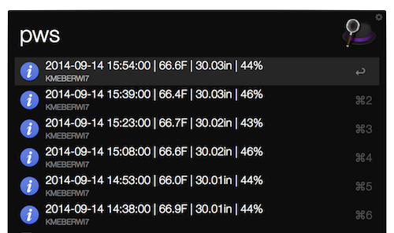

### pws.py

Alfred workflow to get Weather Underground PWS readings

### NEWS 

- Version 0.1 - initial version

### What's it do?

- Returns last 5 readings (date/time, temp, barometer, humidity) in Alfred window
- Enables copying of full current day's CSV to clipboard
- URL action goes to PWS readings page

### Requires

* alfred-workflow : https://github.com/deanishe/alfred-workflow (installed to workflow directory)
* the [requests library](http://docs.python-requests.org/en/latest/) (installed to the workfllow "lib" subdirectory)

### Installation

It's probably easiest to install the [compiled workflow](https://github.com/hrbrmstr/alfred-pws/blob/master/pws.alfredworkflow?raw=true) and change the `station` variable in the main script filter. You can also grab it over at [Packal](http://www.packal.org/workflow/pws-history).

To build on your own version:

* Copy script into an Alfred script filter workflow with 0 args
* Change the `station` variable
* If you want to see the station in wunderground after a selecting a reading, setup a URL action to open: http://www.wunderground.com/personal-weather-station/dashboard?ID={query}#history and connect the two objects
* Review the screenshots in the github [img directory](https://github.com/hrbrmstr/alfred-pws/tree/master/img)

Icon (in the compiled workflow and in the repository) from: https://github.com/Tinkerforge/weather-station
